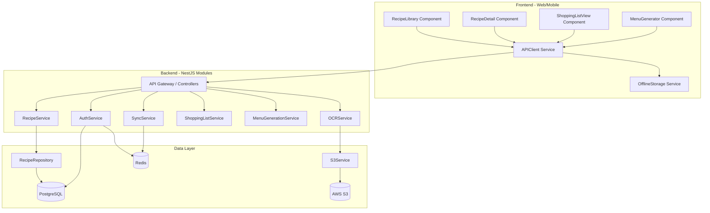

# Components

Based on the architectural patterns, tech stack, and data models, these are the major logical components across both frontend and backend with clear boundaries and interfaces.

## Backend Components

### AuthService (Backend)

**Responsibility:** Handles all authentication and authorization logic including user registration, login, OAuth integration, JWT token generation/validation, and session management.

**Key Interfaces:**
- `register(email, password, firstName): Promise<{ user, tokens }>`
- `login(email, password): Promise<{ user, tokens }>`
- `loginWithOAuth(provider, oauthCode): Promise<{ user, tokens }>`
- `refreshAccessToken(refreshToken): Promise<{ accessToken }>`
- `validateToken(token): Promise<User>`

**Dependencies:** PostgreSQL (User table), Redis (refresh token storage), Passport.js (OAuth strategies), bcrypt (password hashing)

**Technology Stack:** NestJS AuthModule with Passport.js guards, JWT strategy, bcrypt for hashing

### RecipeService (Backend)

**Responsibility:** Core business logic for recipe CRUD operations, search/filtering, portion adjustment calculations, and recipe aggregation queries. Enforces ownership rules and manages recipe lifecycle.

**Key Interfaces:**
- `createRecipe(userId, recipeData): Promise<Recipe>`
- `getRecipe(recipeId, userId): Promise<Recipe>`
- `updateRecipe(recipeId, userId, updates): Promise<Recipe>`
- `deleteRecipe(recipeId, userId): Promise<void>`
- `searchRecipes(userId, filters): Promise<RecipeList>`
- `adjustPortions(recipeId, multiplier): Promise<Recipe>`

**Dependencies:** PostgreSQL, RecipeRepository, TagService, S3Service

**Technology Stack:** NestJS RecipeModule with RecipeService, RecipeRepository (Prisma), class-validator for DTOs

### OCRService (Backend)

**Responsibility:** Handles OCR text extraction from recipe images, intelligent parsing of ingredients/steps, and temporary image storage. Manages Google Cloud Vision API integration with Tesseract.js fallback.

**Key Interfaces:**
- `scanRecipeImage(imageBuffer): Promise<OcrResult>`
- `parseRecipeText(extractedText): Promise<{ title, ingredients, steps }>`
- `uploadTemporaryImage(imageBuffer): Promise<{ tempUrl, expiresAt }>`

**Dependencies:** Google Cloud Vision API, Tesseract.js, S3Service

**Technology Stack:** NestJS OCRModule with Google Cloud Vision client library, Sharp for image optimization

### ShoppingListService (Backend)

**Responsibility:** Generates shopping lists from recipes with intelligent ingredient aggregation, unit conversion, inventory deduction, and manages shopping list sharing/collaboration.

**Key Interfaces:**
- `generateShoppingList(userId, recipeIds, portionAdjustments): Promise<ShoppingList>`
- `aggregateIngredients(ingredients[]): Promise<AggregatedIngredient[]>`
- `convertUnits(quantity, fromUnit, toUnit): number`
- `shareShoppingList(listId, method, recipient): Promise<{ shareUrl }>`

**Dependencies:** PostgreSQL, InventoryService, RecipeService, SendGrid, Twilio

**Technology Stack:** NestJS ShoppingListModule with custom aggregation algorithms, SendGrid client, Twilio client

### MenuGenerationService (Backend)

**Responsibility:** Implements intelligent menu generation algorithm with constraint satisfaction (variety balancing, tag constraints, time distribution) and partial regeneration logic.

**Key Interfaces:**
- `generateMenu(userId, config): Promise<Menu>`
- `balanceProteinVariety(recipes, days): Recipe[]`
- `applyTagConstraints(recipes, tagConstraints): Recipe[]`
- `regenerateMeal(menuId, dayNumber, mealType): Promise<Menu>`

**Dependencies:** PostgreSQL, RecipeService, TagService

**Technology Stack:** NestJS MenuModule with custom algorithm logic, Prisma for menu persistence

### SyncService (Backend)

**Responsibility:** Manages cross-device synchronization with delta sync, conflict detection/resolution (last-write-wins), and sync queue coordination.

**Key Interfaces:**
- `getChangesSince(userId, timestamp): Promise<SyncChanges>`
- `detectConflict(entity, clientVersion, serverVersion): boolean`
- `resolveConflict(entity, strategy): Promise<Entity>`

**Dependencies:** PostgreSQL, Redis, All service modules

**Technology Stack:** NestJS SyncModule with Prisma for timestamp-based queries, Redis for distributed locking

## Frontend Components

### RecipeLibrary (Frontend - Web & Mobile)

**Responsibility:** Displays user's recipe collection with filtering, sorting, search, and navigation to recipe details. Implements infinite scroll or pagination.

**Key Interfaces:**
- `loadRecipes(filters, page): Promise<RecipeListItem[]>`
- `searchRecipes(query): Promise<RecipeListItem[]>`
- `filterByTags(tagIds): void`
- `navigateToRecipe(recipeId): void`

**Dependencies:** RecipeAPIClient, RecipeStore, UI components

**Technology Stack:** React component (web), React Native component (mobile), Zustand for state, React Query for data fetching

### RecipeDetail (Frontend - Web & Mobile)

**Responsibility:** Displays full recipe information including photos, ingredients, steps, tags, and actions (edit, delete, adjust portions, share).

**Key Interfaces:**
- `fetchRecipe(recipeId): Promise<Recipe>`
- `adjustPortions(multiplier): void`
- `rateRecipe(rating): Promise<void>`
- `deleteRecipe(): Promise<void>`

**Dependencies:** RecipeAPIClient, RecipeStore, UI components

**Technology Stack:** React component (web), React Native component (mobile), React Hook Form for edit mode

### ShoppingListView (Frontend - Web & Mobile)

**Responsibility:** Displays shopping list items with check-off capability, organization mode switching (aisle/recipe/alphabetical), sharing, and offline support.

**Key Interfaces:**
- `loadShoppingList(listId): Promise<ShoppingList>`
- `toggleItemChecked(itemId): Promise<void>`
- `changeOrganization(mode): void`
- `shareList(method, recipient): Promise<void>`

**Dependencies:** ShoppingListAPIClient, ShoppingListStore, ShareService

**Technology Stack:** React component with checkbox lists, native share API (mobile), offline-first with IndexedDB/AsyncStorage

### MenuGenerator (Frontend - Web & Mobile)

**Responsibility:** Configuration interface for menu generation with template selection, constraint setting, and calendar view display.

**Key Interfaces:**
- `generateMenu(config): Promise<Menu>`
- `selectTemplate(templateId): void`
- `setTagConstraints(constraints): void`
- `regenerateMeal(dayNumber, mealType): Promise<Menu>`

**Dependencies:** MenuAPIClient, RecipeAPIClient, MenuStore

**Technology Stack:** React component with calendar grid view, drag-and-drop (web), swipe actions (mobile)

### APIClient (Frontend - Shared)

**Responsibility:** Centralized HTTP client for all API communication with authentication token injection, request/response interceptors, error handling, and offline queue management.

**Key Interfaces:**
- `get(endpoint, params): Promise<Response>`
- `post(endpoint, body): Promise<Response>`
- `put(endpoint, body): Promise<Response>`
- `delete(endpoint): Promise<Response>`
- `queueOfflineRequest(request): void`

**Dependencies:** axios, AuthStore, SyncQueue

**Technology Stack:** Axios with interceptors, retry logic, TypeScript interfaces from `packages/shared/`

## Component Interaction Diagram

---
