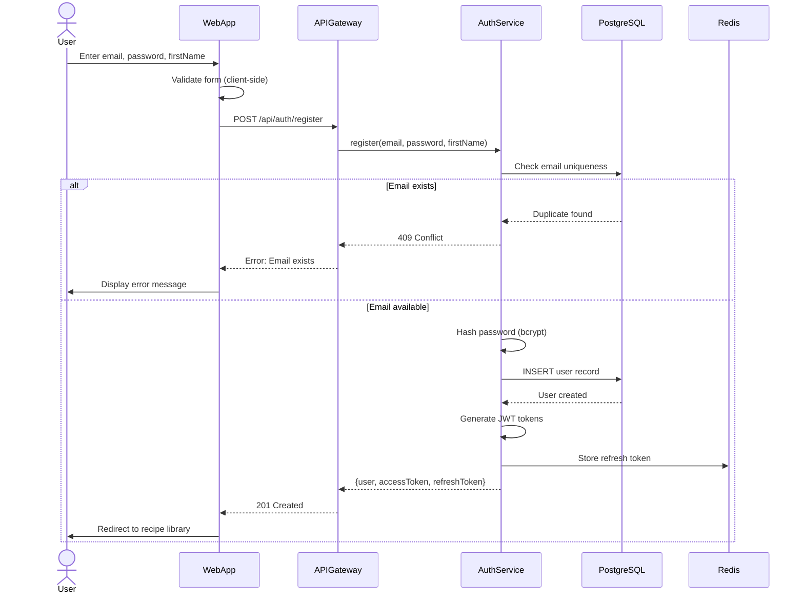
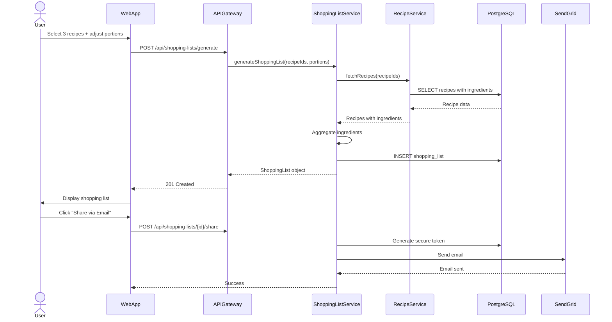

# Core Workflows

Illustrating critical user journeys with sequence diagrams showing component interactions.

## User Registration & First Login

```mermaid
sequenceDiagram
    actor User
    participant WebApp
    participant APIGateway
    participant AuthService
    participant PostgreSQL
    participant Redis

    User->>WebApp: Enter email, password, firstName
    WebApp->>WebApp: Validate form (client-side)
    WebApp->>APIGateway: POST /api/auth/register
    APIGateway->>AuthService: register(email, password, firstName)
    AuthService->>PostgreSQL: Check email uniqueness

    alt Email exists
        PostgreSQL-->>AuthService: Duplicate found
        AuthService-->>APIGateway: 409 Conflict
        APIGateway-->>WebApp: Error: Email exists
        WebApp->>User: Display error message
    else Email available
        AuthService->>AuthService: Hash password (bcrypt)
        AuthService->>PostgreSQL: INSERT user record
        PostgreSQL-->>AuthService: User created
        AuthService->>AuthService: Generate JWT tokens
        AuthService->>Redis: Store refresh token
        AuthService-->>APIGateway: {user, accessToken, refreshToken}
        APIGateway-->>WebApp: 201 Created
        WebApp->>User: Redirect to recipe library
    end
```

## Shopping List Generation & Sharing

```mermaid
sequenceDiagram
    actor User
    participant WebApp
    participant APIGateway
    participant ShoppingListService
    participant RecipeService
    participant PostgreSQL
    participant SendGrid

    User->>WebApp: Select 3 recipes + adjust portions
    WebApp->>APIGateway: POST /api/shopping-lists/generate
    APIGateway->>ShoppingListService: generateShoppingList(recipeIds, portions)

    ShoppingListService->>RecipeService: fetchRecipes(recipeIds)
    RecipeService->>PostgreSQL: SELECT recipes with ingredients
    PostgreSQL-->>RecipeService: Recipe data
    RecipeService-->>ShoppingListService: Recipes with ingredients

    ShoppingListService->>ShoppingListService: Aggregate ingredients
    ShoppingListService->>PostgreSQL: INSERT shopping_list
    ShoppingListService-->>APIGateway: ShoppingList object
    APIGateway-->>WebApp: 201 Created
    WebApp->>User: Display shopping list

    User->>WebApp: Click "Share via Email"
    WebApp->>APIGateway: POST /api/shopping-lists/{id}/share
    ShoppingListService->>PostgreSQL: Generate secure token
    ShoppingListService->>SendGrid: Send email
    SendGrid-->>ShoppingListService: Email sent
    ShoppingListService-->>WebApp: Success
```

---
