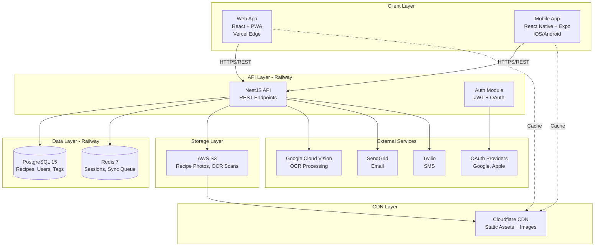

# High Level Architecture

## Technical Summary

BMad Recette employs a **monolithic REST API architecture** with **offline-first progressive web and native mobile clients**, deployed across modern cloud infrastructure. The backend uses **NestJS** (Node.js) with **PostgreSQL** for relational data and **Redis** for session management and sync coordination, while the frontend leverages **React** (web) and **React Native with Expo** (mobile) sharing TypeScript interfaces from a common package. The system integrates **Google Cloud Vision API** for OCR recipe scanning and utilizes **S3-compatible storage** for recipe photos. Deployment follows a hybrid strategy: backend on **Railway** (containerized API + managed PostgreSQL/Redis), web app on **Vercel** (edge-optimized static hosting with serverless functions), and mobile apps distributed via **iOS App Store** and **Google Play Store**. This architecture achieves the PRD's core goals: sub-3-second TTI, real-time cross-platform sync, robust offline functionality, and cost efficiency (<€200/month for 1K users).

## Platform and Infrastructure Choice

**Platform: Hybrid Cloud (Railway + Vercel + Mobile App Stores)**

After evaluating modern fullstack deployment platforms, I recommend a **best-of-breed hybrid approach** rather than locking into a single vendor ecosystem.

**Evaluated Options:**

1. **Vercel + Supabase (Full Managed)**
   - ✅ Pros: Fastest setup, built-in auth/storage, excellent DX
   - ❌ Cons: Supabase doesn't support NestJS backend (requires their serverless functions or separate hosting), vendor lock-in risk, limited control over backend architecture

2. **AWS Full Stack (ECS + RDS + S3 + Cognito)**
   - ✅ Pros: Enterprise-grade scaling, full control, comprehensive service catalog
   - ❌ Cons: Complex setup (~2 weeks), expensive for MVP ($300+/month), steep learning curve, overkill for initial launch

3. **Railway + Vercel Hybrid (Recommended)**
   - ✅ Pros: Railway perfect for NestJS + PostgreSQL + Redis (one-click provision), Vercel ideal for React SSG/SSR, cost-effective (~€150/month), simple deployment, excellent logs/monitoring
   - ✅ Mobile: Native app store distribution (required for offline features, camera access)
   - ⚠️ Cons: Multi-platform management (not single dashboard), but acceptable trade-off

**Selected Platform: Railway + Vercel + App Stores**

**Key Services:**
- **Backend API**: Railway (NestJS container, PostgreSQL 15, Redis 7)
- **Web App**: Vercel (React SPA with edge caching, incremental static regeneration)
- **File Storage**: AWS S3 (recipe photos, OCR scans, backups)
- **OCR**: Google Cloud Vision API (primary), Tesseract.js fallback
- **Email**: SendGrid (transactional, shopping list sharing)
- **SMS**: Twilio (shopping list sharing)
- **Monitoring**: Sentry (error tracking), Railway/Vercel built-in metrics
- **CDN**: Cloudflare (free tier, fronts S3 and Vercel for global performance)

**Deployment Hosts and Regions:**
- **Railway**: EU-West-1 (Frankfurt) for GDPR compliance and low latency to European users
- **Vercel**: Auto-distributed to global edge network (primary: Frankfurt, Paris, London)
- **S3**: EU-West-1 (Frankfurt) with CloudFront CDN
- **Mobile**: Global distribution via App Store/Play Store CDNs

## Repository Structure

**Structure: Monorepo (Turborepo)**

**Monorepo Tool: Turborepo 2.x**

**Package Organization:**

```
bmad-recette/
├── apps/
│   ├── api/          # NestJS backend application
│   ├── web/          # React web application
│   └── mobile/       # React Native (Expo) mobile application
├── packages/
│   ├── shared/       # Shared TypeScript types, utilities, constants
│   ├── ui/           # Shared UI components (React + React Native compatible)
│   └── config/       # Shared configs (ESLint, TypeScript, Jest)
├── infrastructure/   # IaC definitions (if needed for advanced deployment)
├── scripts/          # Build, deploy, and seed scripts
└── docs/             # Documentation (PRD, architecture, etc.)
```

**Rationale:**
- **apps/**: Each deployable application isolated with its own package.json and build config
- **packages/shared/**: Critical for type safety—API contracts (DTOs), business logic utilities, validation schemas shared across all apps
- **packages/ui/**: React components designed for cross-platform compatibility (React + React Native via react-native-web patterns where possible)
- **packages/config/**: DRY principle for linting, TypeScript, testing configs
- **Turborepo caching**: Shared packages cached globally, only rebuild what changed
- **Workspace dependencies**: `apps/web` imports from `@bmad/shared`, `apps/api` imports from `@bmad/shared` for type-safe API contracts

## High Level Architecture Diagram



## Architectural Patterns

- **Monolithic Modular Backend (NestJS):** Single deployable backend organized into cohesive modules (AuthModule, RecipeModule, TagModule, MenuModule, OCRModule, SyncModule). Each module encapsulates related routes, services, and data access logic, enabling future microservices extraction if scaling demands it. _Rationale:_ Fastest development velocity for MVP, simpler debugging, reduced operational overhead, yet maintains clear boundaries for future decomposition.

- **Offline-First Progressive Enhancement:** Clients (web + mobile) prioritize local data storage (IndexedDB/SQLite) with background synchronization to the server. All read operations check local cache first, writes queue for sync when offline. _Rationale:_ Meets NFR5 (100% offline recipe viewing), critical for in-kitchen usage where connectivity may be unreliable, enhances perceived performance.

- **Repository Pattern (Backend):** Abstract all database access behind repository interfaces (`RecipeRepository`, `UserRepository`, etc.) that hide ORM details from business logic. _Rationale:_ Enables comprehensive unit testing with mocked repositories, provides flexibility to swap ORMs (TypeORM → Prisma) or databases without rewriting business logic, enforces single responsibility principle.

- **API Gateway Pattern (Implicit):** While we use a monolithic API, NestJS acts as a unified gateway providing centralized authentication (JWT guards), rate limiting, request validation, and error handling before reaching business logic. _Rationale:_ Simplifies client-side error handling, enables consistent security policies, provides single point for observability (logging, metrics).

- **Component-Based UI with Shared Design System:** React components follow atomic design (atoms → molecules → organisms) with shared components in `packages/ui/` designed for React + React Native dual compatibility. _Rationale:_ Maximizes code reuse between web and mobile (~40% component sharing achievable), ensures visual consistency, accelerates development of new features.

- **Optimistic UI Updates:** Client applications immediately update local state on user actions (e.g., checking off shopping list item) and asynchronously sync to server, rolling back only on failure. _Rationale:_ Achieves instant perceived responsiveness even on slow connections, aligns with offline-first philosophy, dramatically improves UX for high-frequency actions.

- **Eventual Consistency with Last-Write-Wins (MVP):** Cross-device sync uses timestamp-based conflict resolution where most recent `updatedAt` wins during concurrent edits. _Rationale:_ Simplest conflict resolution for MVP scope, acceptable for personal recipe management (low conflict probability), avoids complex CRDT or operational transformation overhead.

---
