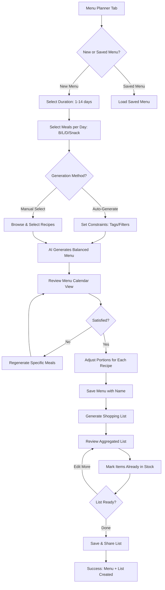
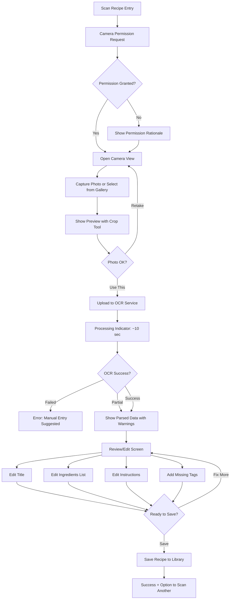
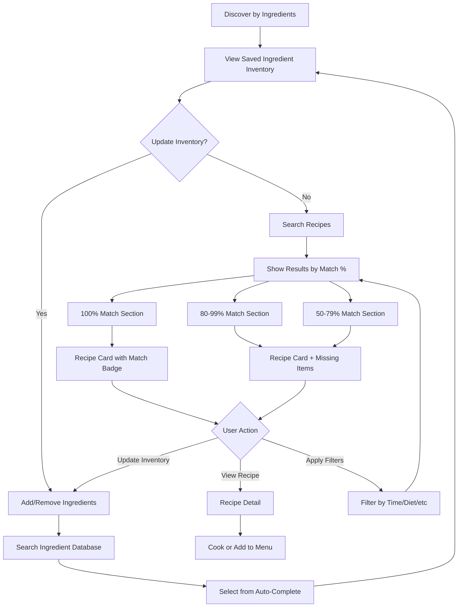
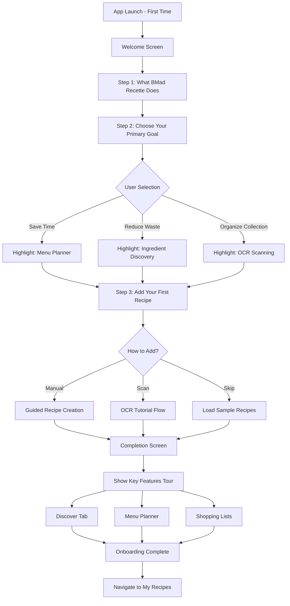

# BMad Recette UI/UX Specification

This document defines the user experience goals, information architecture, user flows, and visual design specifications for BMad Recette's user interface. It serves as the foundation for visual design and frontend development, ensuring a cohesive and user-centered experience.

## Introduction

### Overall UX Goals & Principles

#### Target User Personas

1. **Busy Young Professional (Primary)** - "The Efficient Organizer"
   - Age 25-35, lives in urban area, works 40+ hours/week
   - **Pain Points**: Limited time for meal planning (wants <15 min/week), scattered recipes across multiple sources
   - **Goals**: Quick recipe discovery, minimal decision fatigue, seamless grocery shopping
   - **Tech Comfort**: High - expects mobile-first, cloud-sync experiences

2. **Budget-Conscious Parent (Secondary)** - "The Waste Minimizer"
   - Age 30-45, family of 3-5, manages household budget
   - **Pain Points**: Food waste, duplicate grocery purchases, meal variety for picky eaters
   - **Goals**: Use existing ingredients, track inventory, reduce waste by 50%+
   - **Tech Comfort**: Medium - values simplicity and reliability

3. **Culinary Enthusiast (Tertiary)** - "The Collector"
   - Age 25-65, owns 20+ cookbooks, experiments with world cuisines
   - **Pain Points**: Recipe organization chaos, lost magazine clippings, hard to search physical collections
   - **Goals**: Digitize entire collection via OCR, powerful tagging/search, recipe inspiration
   - **Tech Comfort**: Medium-High - willing to learn for powerful features

#### Usability Goals

1. **Ease of learning**: New users complete first recipe creation and shopping list generation within 5 minutes of onboarding
2. **Efficiency of use**: Power users generate weekly menu + shopping list in under 2 minutes (down from 2-3 hours)
3. **Error prevention**: Clear validation for recipe inputs, confirmation dialogs for destructive actions, undo capability
4. **Memorability**: Infrequent users can return after 2 weeks and complete core tasks without tutorials
5. **Offline resilience**: Users can view/use recipes without internet, with clear sync status indicators

#### Design Principles

1. **Clarity over cleverness** - Prioritize clear labels and standard UI patterns over novel interactions; users should never wonder "what does this do?"
2. **Progressive disclosure** - Show only what's needed at each step (e.g., advanced filters collapsed by default, portion adjustment appears on hover)
3. **Consistent patterns** - Reuse interaction models across features (e.g., checkbox selection pattern for recipes works same in menu builder and shopping list generator)
4. **Immediate feedback** - Every action has visible response within 100ms (loading states, optimistic updates, success confirmations)
5. **Accessible by default** - Design for keyboard navigation, screen readers, and high-contrast modes from day one (WCAG 2.1 AA compliance)

#### Change Log

| Date | Version | Description | Author |
|------|---------|-------------|--------|
| 2026-01-07 | 0.1 | Initial UI/UX specification creation | Sally (UX Expert) |

## Information Architecture (IA)

### Site Map / Screen Inventory

```mermaid
graph TD
    A[App Shell] --> B[My Recipes]
    A --> C[Discover]
    A --> D[Menu Planner]
    A --> E[Shopping Lists]
    A --> F[Account]

    B --> B1[Recipe Grid View]
    B --> B2[Recipe Detail]
    B --> B3[Create/Edit Recipe]
    B --> B4[Scan Recipe OCR]

    B1 --> B1a[Search & Filter]
    B1 --> B1b[Tag Management]
    B3 --> B3a[Manual Entry]
    B3 --> B3b[Template Selection]

    C --> C1[By Ingredients I Have]
    C --> C2[By Tags/Categories]
    C --> C3[Saved Favorites]

    C1 --> C1a[Ingredient Inventory]
    C1 --> C1b[Matching Recipes]

    D --> D1[Create New Menu]
    D --> D2[Saved Menus]
    D --> D3[Menu Detail View]

    D1 --> D1a[Day/Meal Configuration]
    D1 --> D1b[Recipe Selection]
    D1 --> D1c[Auto-Generate]

    E --> E1[Active Lists]
    E --> E2[Create from Recipes]
    E --> E3[List Detail]

    E3 --> E3a[Shopping Mode]
    E3 --> E3b[Share List]

    F --> F1[Profile]
    F --> F2[Settings]
    F --> F3[Data Export]
    F --> F4[Onboarding/Tutorial]
```

### Navigation Structure

**Primary Navigation:** Tab bar (mobile) / Sidebar (web) with 5 main sections:
- 🍳 **My Recipes** - Recipe library and management (default landing screen)
- 🔍 **Discover** - Find recipes by ingredients or tags
- 📅 **Menu Planner** - Weekly/daily meal planning
- 🛒 **Shopping Lists** - Active and past shopping lists
- 👤 **Account** - Settings, profile, data management

**Secondary Navigation:** Contextual action bars and floating action buttons:
- **Recipe Detail**: Edit, Delete, Add to Menu, Generate Shopping List, Share
- **Menu Planner**: Save Menu, Generate Shopping List, Regenerate Meal
- **Shopping List Detail**: Organize By (aisle/recipe/alphabetical), Share, Mark All Purchased

**Breadcrumb Strategy:**
- Mobile: Back button + screen title (hierarchical navigation)
- Web: Traditional breadcrumbs for deep pages (e.g., "My Recipes > Italian > Pasta Carbonara")
- Persistent context: Show current filter/search state in header subtitle

## User Flows

### Flow 1: Create Weekly Menu & Generate Shopping List

**User Goal:** Generate a complete week of meals and shopping list in under 2 minutes

**Entry Points:**
- Menu Planner tab → "Create New Menu" button
- Quick action from home screen
- Recipe detail → "Add to Menu" (starts menu creation)

**Success Criteria:** User has a saved 7-day menu and downloadable/shareable shopping list

#### Flow Diagram

#### Edge Cases & Error Handling:
- **No recipes in library**: Show onboarding prompt to add recipes first, offer sample recipes
- **Filter too restrictive**: Warning if <7 recipes match constraints, suggest loosening filters
- **Portion adjustment causes fractional ingredients**: Round intelligently (1.3 eggs → 2 eggs)
- **Offline mode**: Menu creation cached locally, sync when online
- **Duplicate ingredients across recipes**: Smart aggregation with unit conversion (2 cups milk + 500ml milk = 3 cups)

**Notes:** Auto-generation uses PRD's variety balancing (FR28) - no repeated main ingredients within 3 days, protein rotation. Loading state must show within 100ms, full generation within 5 seconds (NFR4).

---

### Flow 2: Add Recipe via OCR Scan

**User Goal:** Digitize a physical recipe (cookbook, magazine) in under 1 minute

**Entry Points:**
- My Recipes → FAB "+" → "Scan Recipe"
- Create Recipe screen → "Scan from Photo" tab

**Success Criteria:** Recipe successfully parsed, user reviews/edits, and saves to library

#### Flow Diagram

#### Edge Cases & Error Handling:
- **Poor image quality**: Show tips (good lighting, flat surface, avoid shadows) before retry
- **Non-recipe text detected**: Confidence score <60% → suggest manual entry
- **Multiple recipes on one page**: Allow crop/region selection before OCR
- **Offline mode**: Queue photo locally, process when online (with notification)
- **OCR timeout (>10s)**: Fallback to Tesseract.js client-side processing

**Notes:** OCR uses Google Cloud Vision API (primary) per architecture doc. Must comply with NFR3 (10-second processing). Photo stored in S3 and attached to recipe.

---

### Flow 3: Find Recipes by Available Ingredients

**User Goal:** Use up existing ingredients to minimize waste and avoid grocery shopping

**Entry Points:**
- Discover tab → "By Ingredients I Have"
- Home screen quick action "What Can I Cook?"

**Success Criteria:** User finds recipe(s) matching available ingredients and starts cooking or adds to menu

#### Flow Diagram

#### Edge Cases & Error Handling:
- **Empty inventory**: Show tutorial "Add ingredients you have" with common items checklist
- **No matches**: Suggest loosening to partial matches, offer most popular recipes
- **Ambiguous ingredients**: "Tomato" matches "fresh tomato", "canned tomatoes", "tomato paste" - show all variants
- **Expired ingredients**: Optional feature to track expiration dates (post-MVP)
- **Unit mismatches**: Normalize all to common units (grams, ml) for accurate matching

**Notes:** Implements FR21-FR26. Results prioritized by match percentage (FR24), clearly show missing ingredients for partial matches (FR26).

---

### Flow 4: First-Time User Onboarding

**User Goal:** Understand core features and complete first recipe + menu in under 5 minutes

**Entry Points:**
- First app launch after signup/login
- Account → "Tutorial" (re-accessible)

**Success Criteria:** User completes onboarding, has at least 1 recipe in library, understands navigation

#### Flow Diagram

#### Edge Cases & Error Handling:
- **User quits mid-onboarding**: Save progress, offer "Continue Tutorial" on next launch
- **Skip all**: Allow skip at any step, show persistent "Finish Tutorial" in Account settings
- **Sample recipes**: Pre-load 5-10 diverse recipes if user skips adding their own
- **Offline during onboarding**: All steps work offline, sync when connected

**Notes:** Meets NFR35 (3 steps or fewer). Personalization based on user goal selection (step 2) to reduce cognitive load.

## Wireframes & Mockups

### Primary Design Files

**Design Tool:** Figma
**Link:** [To be created - BMad Recette Design System & Screens]
**Structure:** Organize by platform (Web, Mobile) → Feature (Recipes, Menu, Shopping) → Screen state (Empty, Loading, Error, Success)
**Collaboration:** Share with development team for component specs and asset export

### Key Screen Layouts

#### Screen 1: Recipe Grid View (My Recipes - Default Landing)

**Purpose:** Browse and manage user's recipe library, primary entry point for most sessions

**Key Elements:**
- **Header**: Search bar, filter chips (Quick, Vegetarian, Favorites, etc.), view toggle (grid/list), sync status icon
- **Recipe Cards**: Photo thumbnail, title, star rating, tag pills (3 max visible), prep time badge, checkbox for multi-select
- **Floating Action Button (FAB)**: "+" to create new recipe (expands to Quick Add / Manual / Scan / Import options)
- **Empty State**: Illustration + "Add your first recipe" CTA with onboarding link
- **Bottom Tab Bar** (Mobile): My Recipes (active), Discover, Menu, Shopping, Account

**Interaction Notes:**
- Card tap → Recipe Detail
- Long press / checkbox → Multi-select mode (batch actions: Add to Menu, Delete, Export)
- Pull-to-refresh for sync
- Infinite scroll with "Load more" pagination
- Filter chips persist scroll position when applied
- FAB Quick Add → Modal with title + photo fields only, "Add Details Later" saves immediately

**Design File Reference:** [Figma Frame: Mobile/Recipes/Grid-View]

---

#### Screen 2: Recipe Detail View (Tabbed Layout)

**Purpose:** Display complete recipe information for cooking, with quick actions

**Key Elements:**
- **Hero Section**: Large photo (swipeable if multiple), portion adjuster (×0.5, ×1, ×2, custom), star rating, tags
- **Meta Bar**: Prep time, Cook time, Total time, Servings (editable)
- **Tab Navigation**:
  - **Ingredients Tab** (default): Checkable list with quantities (updates with portion multiplier), "Add to Shopping List" button
  - **Instructions Tab**: Numbered steps, large text for cooking mode
  - **Notes Tab**: User notes, source attribution, dietary warnings
- **Action Bar** (sticky bottom): Edit, Add to Menu, Share, Delete (⋮ menu)
- **Offline Indicator**: Small banner if recipe not synced

**Interaction Notes:**
- Ingredients checkboxes persist across sessions (cooking progress tracking)
- Portion adjuster shows real-time quantity updates across all tabs
- Instructions tab supports "Hands-free mode" button (enlarges text, enables voice commands - post-MVP)
- Photo tap → Full-screen gallery
- Tab switching preserves scroll position

**Design File Reference:** [Figma Frame: Mobile/Recipes/Detail-View-Tabs]

---

#### Screen 3: Menu Planner - Calendar View

**Purpose:** Visualize weekly menu, regenerate meals, navigate to shopping list

**Key Elements:**
- **Week Navigation**: < > arrows, date range header, "Today" quick jump
- **Calendar Grid**: 7 days × 3 meals (Breakfast, Lunch, Dinner), each slot shows recipe thumbnail + title
- **Empty Slots**: "+" placeholder to add recipe or auto-generate
- **Top Actions**: Save Menu, Auto-Generate Menu, Generate Shopping List (prominent button)
- **Menu Info Card**: Total recipes, estimated cost, dietary balance chart (protein/carb/fat)

**Interaction Notes:**
- Tap recipe slot → View recipe detail (with "Remove from menu" option)
- Tap empty slot → Choice: Auto-generate this meal OR Browse recipes
- Long press recipe → Regenerate just this meal
- Drag & drop to rearrange meals (web only)
- "Generate Shopping List" → Transition to shopping list with all menu items pre-selected

**Design File Reference:** [Figma Frame: Mobile/Menu/Calendar-View]

---

#### Screen 4: Shopping Lists - List Management View

**Purpose:** Manage multiple shopping lists, create new lists, access active lists

**Key Elements:**
- **Active Lists Section**: Cards showing list name, item count (X/Y checked), creation date, "Continue" button
- **Past Lists Section** (collapsible): Completed lists with archive/delete options
- **FAB**: "+" to create new list (options: From Recipes, From Menu, Blank List)
- **Empty State**: "Create your first shopping list" with suggested entry points

**Interaction Notes:**
- List card tap → Open list detail view
- Swipe left on list card → Quick actions (Share, Duplicate, Delete)
- Support multiple active lists simultaneously
- Lists sorted by most recent activity

**Design File Reference:** [Figma Frame: Mobile/Shopping/List-Management]

---

#### Screen 5: Shopping List - Active List Detail View

**Purpose:** Organize and check off items during grocery shopping, optimize for in-store use

**Key Elements:**
- **Header**: List name (editable), organization toggle (By Aisle / By Recipe / Alphabetical), share button
- **Item Sections**: Collapsible categories (Produce, Dairy, Pantry, etc. for aisle view)
- **List Items**: Checkbox, ingredient name, quantity + unit, recipe source badge (on tap), "Already have" toggle
- **Progress Bar**: X of Y items checked, estimated total cost
- **Floating FAB**: Add custom item
- **Bottom Actions**: Clear All Checked, Mark All Done (completes list)

**Interaction Notes:**
- Check item → Strike-through, move to bottom of section
- "Already have" toggle → Grays out, excludes from cost estimate
- Organization toggle → Instant re-sort with animation
- Share button → Options: SMS, Email, Copy Link (with real-time collaboration indicator)
- Offline-first: All checks persist locally, sync when online

**Design File Reference:** [Figma Frame: Mobile/Shopping/Active-List]

---

#### Screen 6: Discover by Ingredients - Results View

**Purpose:** Show recipe matches based on available ingredients, prioritize by feasibility

**Key Elements:**
- **Ingredient Bar** (sticky top): Chips showing selected ingredients (X to remove), "Edit Inventory" button
- **Match Sections**: 3 collapsible groups with counts
  - ✅ 100% Match (green badge) - Recipe cards with "Cook Now" CTA
  - 🟡 Partial Match 80-99% (yellow badge) - Cards show "Need 2 items" + item list
  - 🟠 Partial Match 50-79% (orange badge) - Cards show "Need 5 items"
- **Recipe Cards**: Same as Recipe Grid but with match badge overlay
- **Empty State**: "No matches found. Try adding more ingredients or lowering filters."

**Interaction Notes:**
- Tap ingredient chip → Remove from search, results update immediately
- Tap "Need X items" → Expands to show missing ingredient list
- Apply filters (top-right) → Time, Diet, Difficulty overlays on match results
- "Add to Shopping List" from card → Pre-fills missing ingredients only

**Design File Reference:** [Figma Frame: Mobile/Discover/Ingredients-Results]

---

#### Screen 7: Onboarding - Goal Selection (Step 2 of 3)

**Purpose:** Personalize UX by understanding user's primary motivation

**Key Elements:**
- **Progress Indicator**: 2/3 dots, "Skip" button (top-right)
- **Heading**: "What's most important to you?"
- **Goal Cards**: 3 large selectable cards with icons + descriptions
  - ⚡ Save Time: "Generate weekly menus in minutes"
  - ♻️ Reduce Waste: "Use ingredients you already have"
  - 📚 Organize: "Digitize your recipe collection"
- **CTA Button**: "Continue" (enabled after selection)

**Interaction Notes:**
- Card selection → Highlight with scale animation, others dim
- "Continue" → Proceeds to personalized Step 3 (different screen based on selection)
- "Skip" → Goes to Step 3 with neutral state (no feature emphasis)
- Back button → Return to Step 1 (welcome screen)

**Design File Reference:** [Figma Frame: Mobile/Onboarding/Goal-Selection]

## Component Library / Design System

### Design System Approach

**Decision: Custom Design System built on Material Design 3 (Material You) foundation**

**Rationale:**
- **Material Design 3** provides battle-tested components with built-in accessibility
- **Customization**: Override theming (colors, typography, shapes) to match BMad Recette brand
- **Cross-platform consistency**: Material Design Web (React) and React Native Paper maintain visual parity
- **Development speed**: Pre-built components reduce implementation time vs. building from scratch

**Implementation Libraries:**
- **Web**: Material UI v5 (MUI) with custom theme
- **Mobile**: React Native Paper v5 with matching theme
- **Shared**: Design tokens in JSON (colors, spacing, typography) imported by both platforms

### Core Components

#### 1. RecipeCard

**Purpose:** Display recipe preview in grids, lists, and search results

**Variants:**
- **Grid Card** (default): Square photo, title below, compact metadata
- **List Card**: Horizontal layout, photo left, details right
- **Compact Card**: Minimal height for dense lists

**States:** Default, Hover/Press (scale + shadow), Selected (checkbox visible, blue border), Loading (skeleton), Offline (grayscale overlay + icon)

**Usage Guidelines:**
- Always show photo (use placeholder if missing)
- Limit title to 2 lines with ellipsis
- Show max 3 tag pills, prioritize dietary tags
- Star rating required, prep time optional

---

#### 2. IngredientInput

**Purpose:** Add/edit ingredients with autocomplete and structured data

**Variants:** Create Mode (empty fields), Edit Mode (pre-filled with delete button), Readonly Mode (display-only)

**States:** Empty, Focused (autocomplete dropdown visible), Filled, Error (invalid quantity/unit), Disabled

**Usage Guidelines:**
- 3 fields: Quantity (numeric), Unit (dropdown), Name (autocomplete)
- Autocomplete triggers after 2 characters
- Tab key navigates Quantity → Unit → Name → Next Ingredient
- Enter key adds new ingredient row

---

#### 3. TagChip

**Purpose:** Display and filter by recipe tags

**Variants:** Static Chip (non-interactive), Removable Chip (with X button), Selectable Chip (toggle on/off)

**States:** Default (outlined), Selected (filled with brand color), Hover/Press, Disabled (greyed out)

**Usage Guidelines:**
- Color-code by category: Green (Diet), Blue (Cuisine), Orange (Time), etc.
- Max width 120px with ellipsis
- Icon prefix optional (e.g., ⏱️ for time tags)
- Group by category in filter menus

---

#### 4. PortionAdjuster

**Purpose:** Scale recipe servings and update ingredient quantities

**Variants:** Stepper (- / + buttons), Slider (continuous 0.5x to 4x), Preset Buttons (×0.5, ×1, ×2, ×4)

**States:** Default (×1), Adjusted (highlight multiplier in brand color), Disabled (while loading)

**Usage Guidelines:**
- Always display current multiplier (e.g., "×2 servings")
- Show original servings count nearby for reference
- Debounce updates by 300ms to avoid excessive recalculations
- Round fractional results intelligently (1.3 eggs → 1-2 eggs range)

---

#### 5. ShoppingListItem

**Purpose:** Display and interact with shopping list ingredients

**Variants:** Unchecked Item, Checked Item (strike-through, bottom), Grouped Item (aggregated from multiple recipes)

**States:** Unchecked, Checked, "Already Have" (greyed out), Editing (quantity/name editable), Swipe Actions Revealed (Delete, Edit)

**Usage Guidelines:**
- Checkbox must be large (min 44×44px touch target)
- Show recipe source badge on tap (e.g., "From: Pasta Carbonara")
- Display aggregated quantity clearly (e.g., "500g (from 3 recipes)")
- Support swipe left for quick actions

---

#### 6. MenuSlot

**Purpose:** Display or add recipes in menu calendar grid

**Variants:** Empty Slot (dashed border, "+" icon), Filled Slot (recipe thumbnail, title, portion indicator), Loading Slot (shimmer/skeleton)

**States:** Empty, Filled, Hover/Press (shows quick actions overlay), Regenerating (loading spinner), Error (red border, "Generation failed")

**Usage Guidelines:**
- Fixed aspect ratio 4:3 or 1:1 depending on viewport
- Show meal type label (Breakfast, Lunch, Dinner) above slot
- Long press reveals "Regenerate" and "Remove" actions
- Drag handle appears on hover (web) for reordering
- Support inline portion adjustment via stepper overlay (mobile) and header-level adjustment (web)

---

#### 7. SearchBar

**Purpose:** Search recipes by name, ingredients, or tags

**Variants:** Standard (full-width with icon), Compact (collapsible icon-only), With Filters (filter chips below)

**States:** Empty (placeholder text), Focused (keyboard visible, suggestions), Filled (X clear button), Loading (spinner in icon)

**Usage Guidelines:**
- Debounce search by 500ms after user stops typing
- Show recent searches on focus (max 5)
- Support voice input button (mobile)
- Clear button always visible when filled

---

#### 8. OCRFeedbackBanner

**Purpose:** Show OCR processing status and confidence scores

**Variants:** Processing (animated progress bar), Success (green checkmark), Partial Success (yellow warning), Error (red alert)

**States:** Processing (animated), Success (auto-dismiss after 3s), Warning (requires dismissal), Error (with retry button)

**Usage Guidelines:**
- Show confidence score only for Partial Success (e.g., "85% confident")
- Highlight low-confidence fields in yellow on review screen
- Always provide manual entry escape hatch
- Position at top of screen, pushes content down

---

#### 9. FilterDrawer

**Purpose:** Display advanced filtering options in a slide-out panel

**Variants:** Bottom Sheet (mobile), Side Panel (web/tablet)

**States:** Closed, Opening (slide animation), Open, Closing, Applying (loading spinner on CTA)

**Usage Guidelines:**
- Group filters by category with collapsible sections
- Show active filter count badge on trigger button
- Include "Clear All" and "Apply" CTAs at bottom
- Preserve filter state across sessions
- Support keyboard navigation (web)

---

#### 10. EmptyState

**Purpose:** Provide guidance when screens have no content

**Variants:** First-Time Empty (onboarding focus), Filter Empty (no results), Error Empty (something went wrong)

**States:** Default, With CTA Button, With Illustration

**Usage Guidelines:**
- Always include helpful illustration (friendly, not clinical)
- Primary message: Clear, empathetic (e.g., "No recipes yet!")
- Secondary message: Action-oriented (e.g., "Add your first recipe to get started")
- CTA button when there's a clear next action
- Support custom illustrations per feature context

## Branding & Style Guide

### Visual Identity

**Brand Guidelines:** [To be created - BMad Recette Brand Guidelines]

**Brand Personality:**
- **Friendly & Approachable**: Cooking should feel enjoyable, not intimidating
- **Efficient & Modern**: Clean interfaces that respect users' time
- **Trustworthy & Reliable**: Dependable tool for daily meal planning
- **Warm & Inviting**: Food-focused aesthetic with appetite appeal

**Design Direction:**
- Modern minimalism with warm accents (avoid sterile tech aesthetic)
- Food photography-forward (recipes are heroes, UI is supportive)
- Generous whitespace for clarity and focus
- Rounded corners and soft shadows (friendly, not corporate)

### Color Palette

#### Light Mode

| Color Type | Hex Code | Usage |
|------------|----------|-------|
| **Primary** | `#FF6B35` (Coral Orange) | Primary actions, FABs, active states, brand accent |
| **Primary Light** | `#FF8F66` | Hover states, light backgrounds |
| **Primary Dark** | `#E5501F` | Pressed states, dark mode primary |
| **Secondary** | `#4ECDC4` (Turquoise) | Secondary actions, progress indicators, success states |
| **Secondary Light** | `#7ED9D1` | Light accents, badges |
| **Accent** | `#F7B731` (Golden Yellow) | Highlights, star ratings, attention-grabbing elements |
| **Success** | `#6FCF97` (Green) | Positive feedback, confirmations, 100% ingredient match |
| **Warning** | `#F7B731` (Yellow) | Cautions, important notices, partial OCR success |
| **Error** | `#EB5757` (Red) | Errors, destructive actions, form validation |
| **Neutral 900** | `#1A1A1A` | Primary text, headings |
| **Neutral 700** | `#4F4F4F` | Secondary text, body copy |
| **Neutral 500** | `#828282` | Disabled text, placeholders |
| **Neutral 300** | `#BDBDBD` | Borders, dividers |
| **Neutral 100** | `#F2F2F2` | Backgrounds, cards |
| **Neutral 50** | `#FAFAFA` | Page backgrounds |
| **White** | `#FFFFFF` | Cards on colored backgrounds, inverted text |

#### Dark Mode

| Color Type | Hex Code | Usage |
|------------|----------|-------|
| **Primary** | `#FF8F66` (Lighter Coral) | Primary actions, FABs, active states (increased contrast) |
| **Primary Light** | `#FFB399` | Hover states |
| **Primary Dark** | `#FF6B35` | Pressed states |
| **Secondary** | `#5DD9CE` (Brighter Turquoise) | Secondary actions, progress indicators |
| **Secondary Light** | `#8FE5DC` | Light accents |
| **Accent** | `#FFC952` (Brighter Yellow) | Highlights, star ratings |
| **Success** | `#81DBAA` (Lighter Green) | Positive feedback, increased visibility |
| **Warning** | `#FFC952` (Bright Yellow) | Cautions, warnings |
| **Error** | `#F77A7A` (Lighter Red) | Errors, destructive actions |
| **Neutral 50** | `#E5E5E5` | Primary text, headings (inverted) |
| **Neutral 100** | `#CCCCCC` | Secondary text |
| **Neutral 300** | `#999999` | Disabled text, tertiary text |
| **Neutral 500** | `#666666` | Borders, dividers |
| **Neutral 700** | `#2D2D2D` | Elevated surfaces, cards |
| **Neutral 900** | `#1A1A1A` | Page backgrounds |
| **Black** | `#0D0D0D` | Deep backgrounds, navigation bars |

**Dark Mode Strategy:**
- **Toggle Location**: Settings > Appearance > Theme (Auto/Light/Dark)
- **Auto Mode**: Follows system preference (prefers-color-scheme media query)
- **Persistence**: Save user preference in local storage and sync across devices
- **Recipe Photos**: Reduce opacity to 90% in dark mode to prevent harsh contrast
- **Transitions**: 200ms ease-in-out when switching modes

**Accessibility Notes:**
- All light mode combinations meet WCAG AA (4.5:1 for text)
- All dark mode combinations meet WCAG AA with adjusted lighter colors
- Primary on Dark Background: 4.8:1 contrast ratio
- Neutral 100 on Neutral 900: 9.2:1 contrast ratio

### Typography

#### Font Families

- **Primary (Headings & UI)**: **Inter** (Google Fonts)
  - Rationale: Excellent readability, professional yet friendly, optimized for screens, consistent across web and mobile
  - Weights used: 400 (Regular), 600 (Semibold), 700 (Bold)
- **Secondary (Body Text)**: **Inter** (same family for cohesion)
- **Monospace (Rare)**: **JetBrains Mono** (for ingredient quantities, timers)

#### Type Scale

| Element | Size | Weight | Line Height | Letter Spacing |
|---------|------|--------|-------------|----------------|
| **H1** | 32px / 2rem | 700 Bold | 40px / 1.25 | -0.02em |
| **H2** | 24px / 1.5rem | 700 Bold | 32px / 1.33 | -0.01em |
| **H3** | 20px / 1.25rem | 600 Semibold | 28px / 1.4 | -0.01em |
| **H4** | 18px / 1.125rem | 600 Semibold | 24px / 1.33 | 0 |
| **Body Large** | 16px / 1rem | 400 Regular | 24px / 1.5 | 0 |
| **Body** | 14px / 0.875rem | 400 Regular | 20px / 1.43 | 0 |
| **Body Small** | 12px / 0.75rem | 400 Regular | 16px / 1.33 | 0 |
| **Caption** | 11px / 0.6875rem | 400 Regular | 14px / 1.27 | 0.01em |
| **Button** | 14px / 0.875rem | 600 Semibold | 20px / 1.43 | 0.01em |
| **Label** | 12px / 0.75rem | 600 Semibold | 16px / 1.33 | 0.02em |

**Responsive Adjustments:**
- **Mobile (<768px)**: H1 → 28px, H2 → 20px, reduce all by ~12%
- **Tablet (768-1024px)**: Use base scale
- **Desktop (>1024px)**: H1 → 36px, H2 → 28px, increase by ~10%

### Iconography

**Icon Library:** **Lucide Icons** (formerly Feather Icons)

**Usage Guidelines:**
- **Size**: 20px default, 24px for primary actions, 16px for inline icons
- **Stroke Width**: 2px (matches Inter's visual weight)
- **Style**: Outline/stroke style (not filled) for consistency
- **Color**: Inherit text color or use semantic colors (success green, error red)
- **Accessibility**: Always pair with text labels or aria-labels

**Common Icons:**
- Recipe: `ChefHat` or `BookOpen`
- Search: `Search`
- Menu/Calendar: `Calendar`
- Shopping: `ShoppingCart`
- Add: `Plus` or `PlusCircle`
- Edit: `Edit2` or `Pencil`
- Delete: `Trash2`
- More: `MoreVertical`
- Time: `Clock`
- Settings: `Settings`
- Star (Rating): `Star`
- Check: `Check`
- Close: `X`
- Filter: `Filter`
- Share: `Share2`

### Spacing & Layout

**Grid System:** 8px base unit (8px grid)

**Spacing Scale:**
- **xs**: 4px (0.25rem) - Tight spacing, icon-text gaps
- **sm**: 8px (0.5rem) - Component internal padding
- **md**: 16px (1rem) - Default spacing between elements
- **lg**: 24px (1.5rem) - Section spacing
- **xl**: 32px (2rem) - Major section breaks
- **2xl**: 48px (3rem) - Page-level spacing
- **3xl**: 64px (4rem) - Hero sections

**Layout Grids:**
- **Mobile**: 16px side margins, single column
- **Tablet**: 24px side margins, 2-column grid (recipes), 3-column (tags)
- **Desktop**: 12-column grid with 24px gutters, max-width 1280px centered

**Responsive Breakpoints:**
- **Mobile**: 0-767px
- **Tablet**: 768px-1023px
- **Desktop**: 1024px-1439px
- **Wide**: 1440px+ (max content width 1280px maintained)

### Photography Guidelines

**Recipe Photos:**
- **Aspect Ratios**: Flexible with recommended ratios: 4:3 (landscape), 1:1 (square), 3:4 (portrait)
- **Minimum Resolution**: 800×600px (will be resized for performance)
- **Maximum File Size**: 2MB (compressed to 500KB for web)
- **Quality Standards**: Well-lit, appetizing, clear focus on dish
- **Placeholder**: Gradient background with recipe title and cutlery icon when photo missing
- **Dark Mode**: Apply 90% opacity and slight warm filter to prevent harsh contrast

**Photography Style:**
- Natural lighting preferred (warm, inviting)
- Overhead or 45° angle for best food presentation
- Minimal props, focus on the dish
- Consistent color temperature (warm tones: 5000-6000K)

## Accessibility Requirements

### Compliance Target

**Standard:** WCAG 2.1 Level AA

**Rationale:** AA is the industry standard for consumer applications, legally required in many jurisdictions (EU, US public sector), and achievable without compromising design aesthetics.

### Key Requirements

#### Visual:
- **Color contrast ratios**: Minimum 4.5:1 for normal text, 3:1 for large text (18px+ or 14px+ bold)
- **Focus indicators**: Visible 2px outline with 3:1 contrast on all interactive elements
- **Text sizing**: Support browser zoom up to 200% without horizontal scrolling or content loss
- **Color independence**: Never use color alone to convey information (add icons, labels, or patterns)

#### Interaction:
- **Keyboard navigation**: All features operable via keyboard (Tab, Shift+Tab, Enter, Space, Arrow keys)
- **Focus management**: Logical tab order, focus trapping in modals, focus restoration after dialogs close
- **Screen reader support**: Proper ARIA labels, roles, and states for all interactive elements
- **Touch targets**: Minimum 44×44px for mobile (iOS/Android guidelines), 40×40px for web

#### Content:
- **Alternative text**: Descriptive alt text for all recipe photos, decorative images marked as aria-hidden
- **Heading structure**: Proper h1-h6 hierarchy (one h1 per page, no skipped levels)
- **Form labels**: All inputs have associated labels, error messages linked via aria-describedby
- **Skip links**: "Skip to main content" link at top of page for keyboard users

### Testing Strategy

**Manual Testing:**
- Keyboard-only navigation through all flows
- Screen reader testing (NVDA on Windows, VoiceOver on iOS/macOS)
- Color blindness simulation (deuteranopia, protanopia, tritanopia)
- Browser zoom test (200% on all breakpoints)

**Automated Testing:**
- axe DevTools during development
- Lighthouse accessibility audit (target: 100 score)
- Pa11y CI integration in GitHub Actions

**User Testing:**
- Include users with disabilities in usability testing
- Test with real assistive technology users before major releases

## Responsiveness Strategy

### Breakpoints

| Breakpoint | Min Width | Max Width | Target Devices | Layout Strategy |
|------------|-----------|-----------|----------------|-----------------|
| **Mobile** | 0px | 767px | iPhone SE, iPhone 14, Android phones | Single column, stacked cards, bottom navigation |
| **Tablet** | 768px | 1023px | iPad, iPad Mini, Android tablets | 2-column grids, side navigation option, larger touch targets |
| **Desktop** | 1024px | 1439px | Laptops, small desktops | 3-column grids, sidebar navigation, hover states |
| **Wide** | 1440px | - | Large monitors, 4K displays | Max-width 1280px content, increased margins |

### Adaptation Patterns

**Layout Changes:**
- **Mobile**: Single-column recipe grid, full-width cards, collapsible sections
- **Tablet**: 2-column recipe grid, split-view (list + detail), persistent filter sidebar
- **Desktop**: 3-column recipe grid, fixed sidebar navigation, inline modals instead of full-screen

**Navigation Changes:**
- **Mobile**: Bottom tab bar (5 tabs), hamburger menu for secondary navigation, full-screen modals
- **Tablet**: Side tab bar (vertical), persistent secondary navigation, bottom sheet modals
- **Desktop**: Left sidebar (always visible), horizontal secondary navigation, centered modals (max 600px width)

**Content Priority:**
- **Mobile**: Hide non-essential metadata, show "More Info" expandable sections, lazy-load images below fold
- **Tablet**: Show all metadata, expandable sections open by default
- **Desktop**: All content visible, no expandable sections unless content is very long

**Interaction Changes:**
- **Mobile**: Swipe gestures (left/right for tabs, down to refresh), long-press for context menus, FABs for primary actions
- **Tablet**: Mix of touch and mouse (support both), larger touch targets (48×48px), hover states optional
- **Desktop**: Hover states, right-click context menus, keyboard shortcuts, drag-and-drop for reordering

### Responsive Images

- Use `srcset` and `sizes` attributes for recipe photos
- Serve WebP format with JPEG fallback
- Thumbnail sizes: 240px (mobile), 360px (tablet), 480px (desktop)
- Full-size: 800px (mobile), 1200px (tablet/desktop)

## Animation & Micro-interactions

### Motion Principles

1. **Purposeful**: Every animation serves a functional purpose (feedback, guidance, or continuity)
2. **Subtle**: Animations enhance but don't distract (prefer 200-300ms durations)
3. **Responsive**: Instant response (<100ms), smooth transitions, no janky animations
4. **Accessible**: Respect `prefers-reduced-motion` for users with vestibular disorders

### Key Animations

- **Page Transitions:** Fade in/out, 300ms, ease-in-out (between major sections)
- **Card Hover:** Scale 1.02, lift shadow, 200ms, ease-out (desktop recipe cards)
- **Button Press:** Scale 0.98, 100ms, ease-in (all buttons and interactive elements)
- **Modal Open:** Slide up from bottom (mobile), fade + scale from center (desktop), 250ms, ease-out
- **Toast Notifications:** Slide in from top, 300ms, ease-out; auto-dismiss after 3s with fade out
- **Loading States:** Skeleton shimmer (left-to-right sweep), 1.5s loop, linear (recipe cards, lists)
- **Ingredient Check:** Checkbox scale + checkmark draw, 300ms, spring easing (shopping lists)
- **Filter Apply:** Results fade out, re-layout, fade in, 400ms total, ease-in-out
- **Pull-to-Refresh:** Spinner rotation, elastic bounce on release, variable duration
- **Tab Switching:** Content crossfade, 200ms, ease-in-out (recipe detail tabs)

### Easing Functions

- **ease-out**: UI entering screen (modals, dropdowns) - starts fast, ends slow
- **ease-in**: UI leaving screen (closing modals) - starts slow, ends fast
- **ease-in-out**: State changes (expand/collapse, filters) - smooth start and end
- **spring**: Delightful interactions (checkbox checks, FAB tap) - natural bounce

### Reduced Motion

For users with `prefers-reduced-motion: reduce`:
- Disable all decorative animations
- Instant transitions (0ms) instead of timed animations
- Crossfade only for content changes (no slides, scales, or bounces)
- Keep loading indicators (functional, not decorative)

## Performance Considerations

### Performance Goals

- **Page Load**: First Contentful Paint < 1.5s, Time to Interactive < 3s (4G connection)
- **Interaction Response**: Immediate visual feedback < 100ms, action completion < 1s
- **Animation FPS**: Maintain 60fps for all animations (16.67ms per frame)
- **Bundle Size**: Initial JS bundle < 150KB gzipped, total page weight < 1MB

### Design Strategies

**Image Optimization:**
- Lazy-load images below fold (Intersection Observer)
- Serve WebP with JPEG fallback
- Use `loading="lazy"` attribute
- Compress all images to <500KB (TinyPNG, Squoosh)
- Use low-quality image placeholders (LQIP) with blur-up

**Code Splitting:**
- Route-based code splitting (separate bundles per main tab)
- Component lazy-loading for modals and heavy features (OCR scanner)
- Defer non-critical JavaScript (analytics, chat widgets)

**Rendering Optimization:**
- Virtualize long lists (recipe grid with react-window or react-virtuoso)
- Debounce search and filter inputs (500ms)
- Throttle scroll events (16ms / 60fps)
- Use CSS transforms for animations (GPU-accelerated)

**Caching Strategy:**
- Service Worker for offline support
- Cache recipe photos locally (IndexedDB)
- Stale-while-revalidate for API responses
- Precache critical assets (fonts, icons, CSS)

**Performance Monitoring:**
- Lighthouse CI on every PR (fail if score < 90)
- Real User Monitoring (RUM) with Sentry Performance
- Core Web Vitals tracking (LCP, FID, CLS)

## Next Steps

### Immediate Actions

1. **Create Figma Design System** - Build component library with all defined variants and states
2. **Design High-Fidelity Mockups** - Create pixel-perfect screens for all 7 key layouts + additional screens
3. **Conduct Usability Testing** - Test flows with 5-10 users from each persona group
4. **Refine Based on Feedback** - Iterate on designs based on user testing results
5. **Prepare Developer Handoff** - Export design tokens, create component specs, document interactions

### Design Handoff Checklist

- [x] All user flows documented
- [x] Component inventory complete
- [x] Accessibility requirements defined
- [x] Responsive strategy clear
- [x] Brand guidelines incorporated
- [x] Performance goals established
- [ ] Figma design system created
- [ ] High-fidelity mockups complete
- [ ] Interactive prototypes for key flows
- [ ] Design tokens exported (JSON/CSS)
- [ ] Component specifications documented
- [ ] Developer handoff meeting scheduled

### Handoff to Development

**Prerequisites:**
- Complete Figma design system with all components
- High-fidelity mockups for all screens (light + dark mode)
- Interactive prototypes for 4 main flows
- Design token JSON file (colors, spacing, typography)
- Component API specifications (props, states, variants)

**Recommended Tools:**
- **Figma Inspect Mode** - Developers can extract CSS, measurements, assets
- **Storybook** - Build component library in isolation before integration
- **Chromatic** - Visual regression testing for components
- **Design System Documentation** - Centralized reference (use Storybook Docs or Zeroheight)

**Next Phase:** Front-End Architecture Document
- Define React component structure
- Plan state management (Context, Zustand, or Redux)
- Design API integration layer
- Set up routing and navigation
- Configure build tools and development environment
